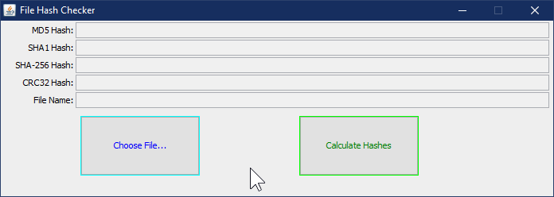
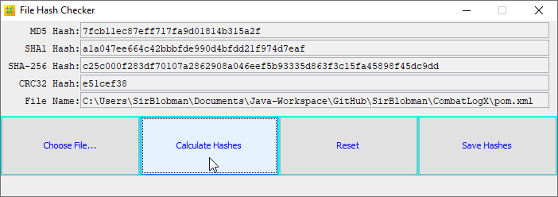

# File Hash Checker

File Hash Checker is a useful program that I use to check hashes of files.  
The following checksum types are available:

- MD5
- SHA-1
- SHA-256
- CRC32

## Requirements

- Java 17

## Screenshots




## Usage

You can use this program by double-clicking the jar file.
If it does not run, try opening it through a command line.

**Windows:**

```shell
> javaw.exe -jar checker-3.0.0.jar
```

**Mac and Linux:**

```shell
$ java -jar checker-3.0.0.jar
```

## Compilation Instructions

This project can be compiled with gradle.

**Windows:**

```shell
> gradlew.bat clean build
```

**Mac and Linux:**

```shell
$ ./gradlew clean build
```
