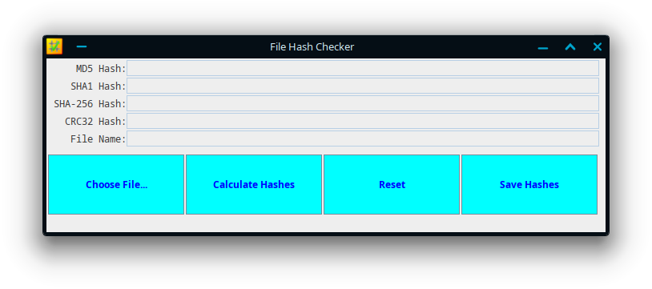
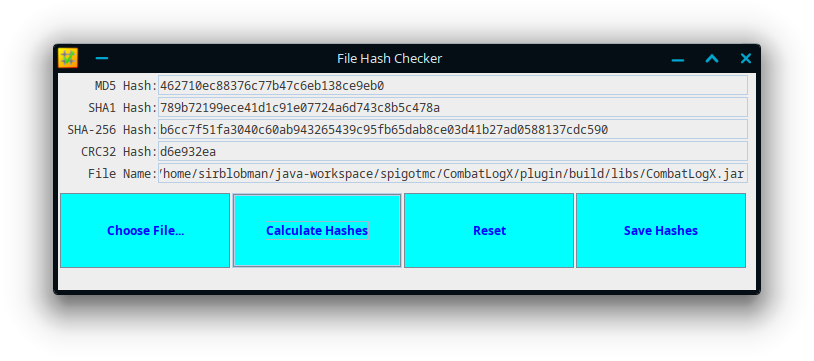

# File Hash Checker

File Hash Checker is a useful program that I use to check hashes of files.  
As of right now, the following checksum types are available:

- MD5
- SHA-1 
- SHA-256 
- CRC32

## Screenshots



## Compilation Instructions

This project can be compiled with gradle.

**Windows:**
```shell
> gradlew.bat clean build
```

**Unix:**
```shell
$ ./gradlew clean build
```
